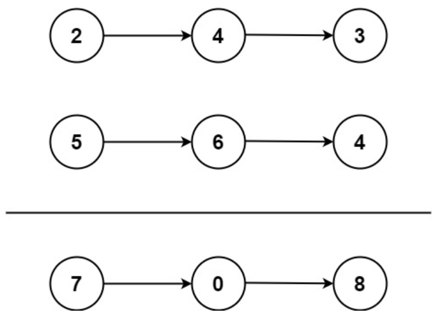

# 2.两数相加

给你两个 **非空** 的链表，表示两个非负的整数。它们每位数字都是按照 **逆序** 的方式存储的，并且每个节点只能存储 **一位** 数字。

请你将两个数相加，并以相同形式返回一个表示和的链表。

你可以假设除了数字 `0` 之外，这两个数都不会以 `0` 开头。

## 示例 1：



- 输入：`l1 = [2,4,3], l2 = [5,6,4]`
- 输出：`[7,0,8]`
- 解释：`342 + 465 = 807.`

## 示例 2：


- 输入：`l1 = [0], l2 = [0]`
- 输出：`[0]`

## 示例 3：


- 输入：`l1 = [9,9,9,9,9,9,9], l2 = [9,9,9,9]`
- 输出：`[8,9,9,9,0,0,0,1]`

**提示：**

- 每个链表中的节点数在范围 `[1, 100]` 内
- `0 <= Node.val <= 9`
- 题目数据保证列表表示的数字不含前导零

---

# 解题

其实就是一道竖式模拟做加法题。

步骤如下：

1. 从链表的头部开始遍历两个链表，同时维护一个进位变量 `carry` 初始值为 0。
2. 在每一位上，将两个链表当前节点的值相加，再加上前一位的进位值 `carry`。
3. 计算当前位的和 `sum`，并将进位 `carry` 更新为 `sum / 10`，以处理可能的进位。
4. 创建一个新节点，将 `sum % 10` 存储在该节点中，这是结果链表中当前位的值。
5. 然后，我们将指针 `current` 指向新创建的节点，更新 `current` 为当前节点。
6. 继续遍历下一位，重复上述步骤，直到两个链表都为空。
7. 如果在循环结束后仍然存在进位，需要将进位加到结果链表的末尾，创建一个新节点存储进位值。
8. 最后，返回结果链表的头部，即 `dummyHead.next`。

```java
/**
 * Definition for singly-linked list.
 * public class ListNode {
 *     int val;
 *     ListNode next;
 *     ListNode() {}
 *     ListNode(int val) { this.val = val; }
 *     ListNode(int val, ListNode next) { this.val = val; this.next = next; }
 * }
 */
class Solution {
    public ListNode addTwoNumbers(ListNode l1, ListNode l2) {
        // 创建一个虚拟头节点，用来存储最终的结果链表
        ListNode dummyHead = new ListNode(0);
        // 创建一个指针 current，用来构建结果链表
        ListNode current = dummyHead;
        // 初始化进位为 0
        int carry = 0;

        // 循环，直到两个输入链表都为空
        while (l1 != null || l2 != null) {
            // 获取 l1 和 l2 当前节点的值，如果为空则默认为 0
            int x = (l1 != null) ? l1.val : 0;
            int y = (l2 != null) ? l2.val : 0;
            // 计算当前位的和，加上进位
            int sum = x + y + carry;
            // 计算新的进位
            carry = sum / 10;
            // 创建一个新节点，存储当前位的值
            current.next = new ListNode(sum % 10);
            // 将指针 current 向前移动一位
            current = current.next;

            // 如果 l1 不为空，移动 l1 指针到下一个节点
            if (l1 != null) l1 = l1.next;
            // 如果 l2 不为空，移动 l2 指针到下一个节点
            if (l2 != null) l2 = l2.next;
        }

        // 如果循环结束后还有进位，需要将进位加到结果链表的末尾
        if (carry > 0) {
            current.next = new ListNode(carry);
        }

        // 返回结果链表的头部，实际结果在 dummyHead.next 中
        return dummyHead.next;
    }
}
```

