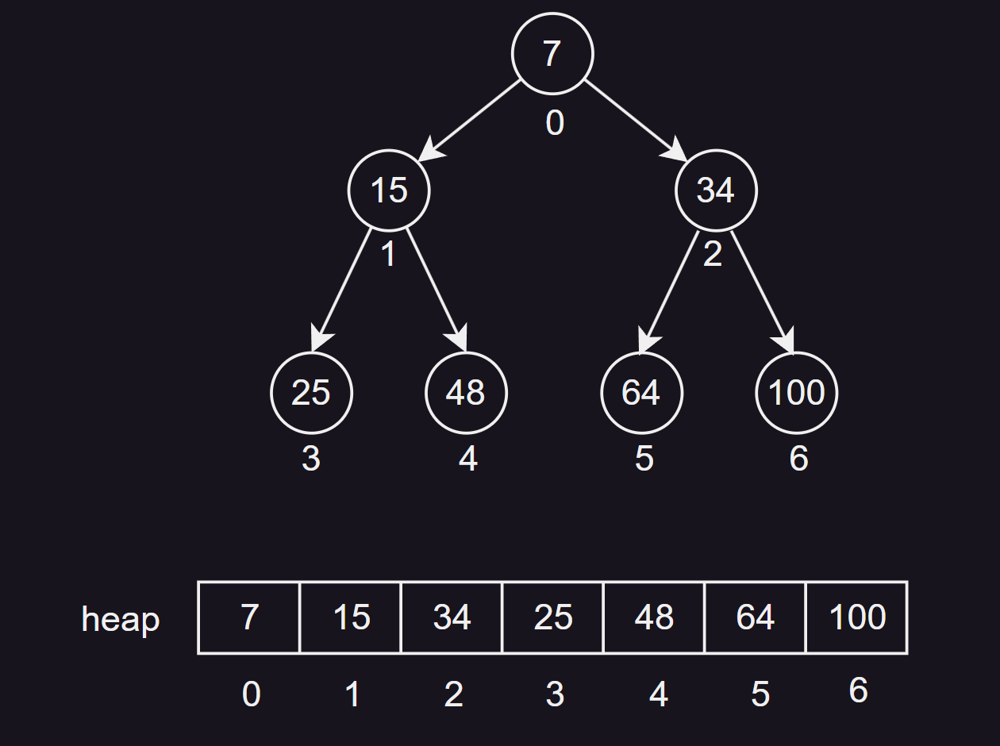

# 1. 前言

## 1.1 什么是堆

堆是一种**特殊的完全二叉树**，它满足任意节点的值都大于等于（或小于等于）其子节点的值。堆常用于实现优先队列和堆排序等算法。

## 1.2 堆支持的操作

堆是一个完全二叉树，也就是说，除了最后一层，其他层的节点都是满的，并且最后一层的节点尽可能地靠左。

堆支持如下操作：

|   操作    |                    描述                     | 时间复杂度 |
| :-------: | :-----------------------------------------: | :--------: |
|  `build`  | 采用**罗伯特·弗洛伊德**提出的较快方式建立堆 |   `O(n)`   |
| `insert`  |            向堆中插入一个新元素             | `O(log n)` |
| `update`  |        将新元素提升使其符合堆的性质         | `O(log n)` |
|   `get`   |            获取当前堆顶元素的值             |   `O(1)`   |
| `delete`  |                删除堆顶元素                 | `O(log n)` |
| `heapify` |        使删除堆顶元素的堆再次成为堆         | `O(log n)` |

在最大堆中，根节点（堆顶）是所有节点中的最大值；在最小堆中，根节点（堆顶）是所有节点中的最小值。新元素总是先插入到完全二叉树的最后一位置，然后通过一系列的交换，将其移动到满足堆序性质的位置。通常删除的是堆顶元素，删除后，将完全二叉树的最后一个元素移动到堆顶，然后通过一系列的交换，将其移动到满足堆序性质的位置。

> 备注：某些堆实现还支持其他的一些操作，如斐波那契堆支持检查一个堆中是否存在某个元素。

## 1.3 堆的分类

堆主要有以下几种分类：

1. **最大堆（大根堆）**：每个节点的值都大于或等于其子节点的值，根节点是最大值。
2. **最小堆（小根堆）**：每个节点的值都小于或等于其子节点的值，根节点是最小值。
3. **反向索引堆**：在堆的基础上增加了反向索引，可以快速找到元素在堆中的位置，主要用于优化堆的删除和修改操作。
4. **二项堆**：是一种特殊的堆，它合并相同大小的二叉树。
5. **斐波那契堆**：是一种优化的堆，在插入和合并操作上比二项堆更高效。
6. **左倾堆（Leftist Heap）**：是一种自我调整的堆，主要用于优先队列。
7. **配对堆（Pairing Heap）**：是一种形式简单，性能出色的堆，主要用于实现优先队列。


## 1.4 PriorityQueue

在Java中，我们可以使用`java.util.PriorityQueue`类来实现堆。`PriorityQueue`是Java标准库中的一个类，它实现了一个优先队列，底层是一个小顶堆。

比如：

1. **创建堆**：我们可以使用`PriorityQueue`的构造函数来创建一个空的堆。

```java
PriorityQueue<Integer> heap = new PriorityQueue<>();
```

2. **插入元素**：我们可以使用`add`方法或者`offer`方法来向堆中插入一个新元素。

```java
heap.add(1);
heap.offer(2);
```

3. **删除元素**：我们可以使用`poll`方法来删除并返回堆顶元素。如果堆为空，`poll`方法会返回`null`。

```java
Integer top = heap.poll();
```

4. **查看堆顶元素**：我们可以使用`peek`方法来获取堆顶元素，但不删除它。如果堆为空，`peek`方法会返回`null`。

```java
Integer top = heap.peek();
```

5. **获取堆的大小**：我们可以使用`size`方法来获取堆的大小。

```java
int size = heap.size();
```

> 备注：`PriorityQueue`默认是一个小顶堆。如果你想实现一个大顶堆，你需要在创建`PriorityQueue`时提供一个自定义的比较器。

## 1.5 使用数组实现堆

实际上，我们在一些竞赛或者笔试中，常用静态数组来实现堆。

堆是一种特殊的完全二叉树。在数组中，我们可以将父节点和子节点的关系映射为数组索引的关系，这样就可以方便地在数组中实现堆的操作。

在数组中，父节点和子节点的索引关系如下：

- 父节点的索引为`i`，那么其左子节点的索引为`2*i+1`，右子节点的索引为`2*i+2`。
- 子节点的索引为`j`，那么其父节点的索引为`(j-1)/2`（整数除法）。

数组的长度和节点有关，当我们向堆中插入一个新元素时，我们首先将新元素添加到数组的末尾，然后进行向上调整（heapify up）。向上调整的过程是：比较新元素和其父节点的值，如果新元素的值大于（或小于，取决于是大顶堆还是小顶堆）其父节点的值，那么就交换这两个元素，然后继续向上调整，直到满足堆的性质。

当我们从堆中删除一个元素（通常是删除堆顶元素）时，我们首先将堆的最后一个元素移动到堆顶，然后进行向下调整（heapify down）。向下调整的过程是：比较新的堆顶元素和其子节点的值，如果堆顶元素的值小于（或大于，取决于是大顶堆还是小顶堆）其子节点的值，那么就交换这两个元素，然后继续向下调整，直到满足堆的性质。

这种使用数组实现堆的方式，既简单又高效，时间复杂度为 $O(log n)$ ，空间复杂度为 $O(n)$ 。

比如下面就是一个小根堆的数组实现：



# 2. 反向索引堆

这节我们主要来看看**反向索引小根堆**，实际上跟普通的小根堆一样，只不过添加了一个索引数组`where`，用于记录每个堆元素在堆中的位置，也不难理解。

## 2.1 背景与含义

反向索引堆的主要动机是优化堆的删除和修改操作。通过增加反向索引，我们可以在`O(1)`的时间内找到元素在堆中的位置，大大提高了效率。

简单来说，反向索引堆是一种特殊的堆，它在堆的基础上增加了一个反向索引表（`where`），这个索引表，用于记录每个堆元素在堆（`heap`）中的位置。这样，当需要更新或删除堆中的某个元素时，可以直接通过这个索引表找到元素的位置，并进行相应的操作，从而提高了操作的效率。

## 2.2 用途

反向索引堆的主要用途是实现优先队列。优先队列是一种特殊的队列，每次出队的是优先级最高（或最低）的元素。在很多应用中，我们需要动态地修改队列中元素的优先级，这时候反向索引堆就派上了用场。

比如，在求解单源最短路径问题时，我们常用Dijkstra算法来求解，这个算法中需要我们维护一个优先队列，队列中的每个元素代表一个节点，元素的优先级是从源节点到该节点的距离。

在算法的执行过程中，我们需要不断地从优先队列中取出距离最短的节点，然后更新其邻居节点的距离。这个更新操作就需要修改优先队列中元素的优先级，如果我们使用普通的堆来实现优先队列，那么这个操作的时间复杂度是O(n)的。

然而，如果我们使用反向索引堆来实现优先队列，那么我们可以在O(1)的时间内找到元素在堆中的位置，然后在O(log n)的时间内更新元素的优先级，大大提高了算法的效率。

## 2.3 实现思路

反向索引堆的实现主要包括两部分：堆的实现和反向索引的实现。

堆的实现和传统的堆基本相同，我们需要实现插入、删除、上浮和下沉等操作。

反向索引的实现则需要我们维护一个额外的数组，这个数组的索引是元素的值，数组的值是元素在堆中的位置。每次我们插入、删除或修改堆中的元素时，我们都需要更新这个反向索引数组。

这样，当我们需要找到一个元素在堆中的位置时，我们只需要查找这个反向索引数组即可。

## 2.4 参考代码（Java版）

这里实现的是小根堆：

```java
package cn.zhengyiyi;

import java.util.Arrays;

public class Main {
    // 主函数
    public static void main(String[] args) {
        n = 5;
        arr = new int[]{0, 5, 4, 3, 2, 1};
        build();
        for (int i = 1; i <= n; i++) {
            insert(i);
        }
        while (!isEmpty()) {
            System.out.print(arr[get()] + " ");
        }
    }
    
    // 堆的最大容量
    public static int MAXN = 1001;
    
    // 堆的实际大小
    public static int n;
    
    // 堆的元素数组
    public static int[] arr = new int[MAXN];
    
    // 反向索引堆
    public static int[] heap = new int[MAXN];

    // where数组，用于记录节点在堆中的位置
    // -1表示节点未进堆、-2表示节点已经出过堆了，其余表示节点位于堆上的i位置
    public static int[] where = new int[MAXN];

    // 堆的当前大小
    public static int heapSize;
    
    // 构建堆的函数
    public static void build() {
        heapSize = 0;
        Arrays.fill(where, 1, n + 1, -1);
    }
    
    // 向堆中插入一个新元素
    public static void insert(int val) {
        heap[heapSize++] = val;
        update(heapSize - 1);
    }
    
    // 使新元素提升，使其符合堆的性质（向上调整）
    public static void update(int index) {
        while (arr[heap[index]] < arr[heap[(index - 1) / 2]]) {
            swap(index, (index - 1) / 2);
            index = (index - 1) / 2;
        }
    }
    
	// 弹出堆顶元素的函数
    public static int get() {
        int ans = heap[0];
        swap(0, --heapSize);
        heapify();
        where[ans] = -2;
        return ans;
    }

	// 使删除堆顶元素的堆再次成为堆（向下调整）
	public static void heapify() {
	    int top = 0; 
	    int left = 1;
	    while (left < heapSize) {
	        int best = left + 1 < heapSize && arr[heap[left + 1]] < arr[heap[left]] ? left + 1 : left;
	        best = arr[heap[top]] < arr[heap[best]] ? top : best;
	        if (best == top) {
	            break;
	        }
	        swap(best, top);
	        top = best;
	        left = top * 2 + 1;
	    }
	}

    // 判断堆是否为空的函数
    public static boolean isEmpty() {
        return heapSize == 0;
    }

    // 交换堆中两个元素的函数
    public static void swap(int i, int j) {
        int tmp = heap[i];
        heap[i] = heap[j];
        heap[j] = tmp;
        where[heap[i]] = i;
        where[heap[j]] = j;
    }
}
```

## 2.5 插入与删除

- `update`：

```java
// 向堆中插入一个新元素
public static void insert(int val) {
    heap[heapSize++] = val;
    update(heapSize - 1);
}

// 向上调整，实现小根堆
public static void update(int index) {
    // 当新元素的值小于其父节点的值时，进行循环
    while (arr[heap[index]] < arr[heap[(index - 1) / 2]]) {
        // 交换新元素和其父节点的位置
        swap(index, (index - 1) / 2);
        // 更新新元素的索引为其父节点的索引
        index = (index - 1) / 2;
    }
}
```

当向堆中插入一个新元素后，可能会破坏堆的性质（在小根堆中，父节点的值必须小于子节点的值），因此如果新元素的值小于父节点的值，那么就交换这两个元素的位置，然后继续向上比较，直到新元素的值大于等于其父节点的值，或者新元素已经成为了堆顶元素（即新元素的索引为0）。

通过不断地将新元素与其父节点进行比较和可能的交换，来保证堆的性质，这就是一个典型的堆的向上调整过程。

- `heapify`：

```java
// 弹出堆顶元素的函数
public static int get() {
    int ans = heap[0];
    swap(0, --heapSize);
    heapify();
    where[ans] = -2;
    return ans;
}

// 向下调整堆
public static void heapify() {
    int top = 0;  	// 堆顶元素的索引
    int left = 1;  	// 堆顶元素的左孩子的索引
    while (left < heapSize) {
        // 如果右孩子存在，并且右孩子的值更小，那么best就取右孩子的索引，否则取左孩子的索引
        int best = left + 1 < heapSize && arr[heap[left + 1]] < arr[heap[left]] ? left + 1 : left;
        
        // 如果父节点的值比当前best节点处的值还小，那么best就是top，否则还是best
        best = arr[heap[top]] < arr[heap[best]] ? top : best;
        
        // 如果best的值等于top，说明top已经处于最佳状态了，已满足堆的性质，此时跳出循环
        if (best == top) {
            break;
        }
        // 如果best不等于top，证明需要交换，将best和top进行转换
        swap(best, top);
        
        // 此时top就变成了best，而左孩子left就更新为top*2+1
        top = best;
        left = top * 2 + 1;
    }
}
```

什么时候需要向下调整？

当堆顶元素被删除后，我们会将堆的最后一个元素移至堆顶，然后进行向下调整，以保证堆的性质。因此我们会不断将父节点与其子节点进行比较和可能的交换，来保证堆的性质（这里是小根堆，父节点的值必须小于子节点的值）。

## 2.6 where数组

现在，我们来看看和普通堆不同的是，方向索引堆添加了哪些内容？

> **回顾**：`where`数组被用于记录每个元素在堆中的位置。

1. 在`build`函数中，`where`数组被初始化，所有元素的位置被设置为-1，表示节点未进堆。

```java
// 构建堆的函数
public static void build() {
    heapSize = 0;
    Arrays.fill(where, 1, n + 1, -1);
}
```

2. 在`swap`函数中，每当堆中的两个元素位置发生交换时，`where`数组也会相应地更新。

```java
// 交换堆中两个元素的函数
public static void swap(int i, int j) {
    int tmp = heap[i];
    heap[i] = heap[j];
    heap[j] = tmp;
    where[heap[i]] = i;
    where[heap[j]] = j;
}
```

3. 在`get`函数中，当堆顶元素被弹出时，`where`数组中对应的位置被设置为-2，表示节点已经出过堆了。

```java
// 弹出堆顶元素的函数
public static int get() {
    int ans = heap[0];
    swap(0, --heapSize);
    heapify();
    where[ans] = -2;
    return ans;
}
```

可以看到，我们只需在这三个地方添加`where`的相关操作，就可以实现在O(1)的时间复杂度内找到任意一个元素在堆中的位置，从而实现了高效的堆操作。


